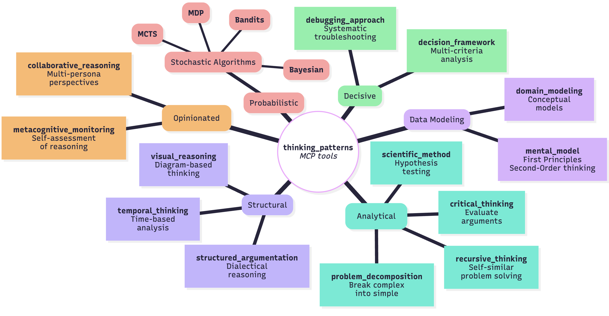

# Thinking Patterns MCP Server

[](https://smithery.ai/server/@emmahyde/thinking-patterns)
[](https://www.npmjs.com/package/@emmahyde/thinking-patterns)

## 📖 Documentation Index

- **[SUMMARY.md](./SUMMARY.md)** - Executive summary and quick overview
- **[SYSTEM_INTENT.md](./SYSTEM_INTENT.md)** - Deep dive into the system's purpose and philosophy
- **[TECHNICAL_ARCHITECTURE.md](./TECHNICAL_ARCHITECTURE.md)** - Technical implementation details and design patterns
- **[README.md](./README.md)** - This file: comprehensive usage guide and examples

---

A comprehensive Model Context Protocol (MCP) server that combines systematic thinking, mental models, debugging approaches, and stochastic algorithms for enhanced problem-solving capabilities. This server merges the functionality of Clear Thought and Stochastic Thinking servers into a unified cognitive toolkit.

## Features

### System

[](https://www.mermaidchart.com/play#pako:eNp1VE1v2zAM_StCTq0BY_diGNCPFbsEDZDelsGgZcbmqg9DkrMGw_77KFlOnLi9GNYj_cj3RPrvStoGV3ersix3Rlqzp_ZuZ4QIHWq8Ew6b4b2UVlm3MylHk2k09DHHWRtubooidGTeyLRVDyGgM74ovtbuy7f0KNaPGxGsVb64vY1fCfFS_0YZ6IDi5t6AOgaSoHJMiN7ZWqGuGpRW99ZTIGt-7lZF8WEk13pwCG8i4grfE0ImWOEpArvVr4ndoRyc59rV1HWiXsKZd4tqXzILKXAJyE0Ib9WB02bUXhKaQHuSlcbQ2SYxL9BM_OPYWzbZk0_HgD5c0klHyZjLRhdopvt-ADVAwHQA1w6aq_oT3XY4e_7Sk2HjOLk5mc6tgbStoZhSacsv1k01PwvOLQLv0ftYNGF2z06D59RLTVYpqK2DxHTKGJV9HMtF1oMKVPboGIXxIvi9HzWddT5BALHmkVax8EmcCeyYjnAWdAYy_zM5H8SGZUniifFZGW9EU764Bp2YDJ_JaawGMiPPJOMKy_SP1kjswwAqHVN01jVKisN34k1na6q9A41_rHsbqRfwhTlxNNDR6A7ExeLhmneL9dC2cU-h5ykG2WXWa3i616MPqPk65Dihzg48-b7jrZ_bsA1ukGFwoE6LkBFsqmkS4bTEnwVz0ScCFS9VZqc-mqIDeTbyanyuwTNfy26VNXhsRh3Le2SZPQ_e1aot0Ez5ShpnfAunN_yHgJoU8UbLqcQ2WNlBRMS9anl9Qqf9FBSiKNZPm6K4AB5ft5fIAxz5fwFmjj6AaYgX3az-_Qd2EQSk)


### Available Tools

1. **sequential_thinking** - Dynamic multi-step thinking with revision support
1. **mental_model** - Structured mental models for problem-solving
1. **debugging_approach** - Systematic debugging methodologies
1. **collaborative_reasoning** - Multi-perspective collaborative problem solving
1. **decision_framework** - Structured decision analysis and rational choice
1. **metacognitive_monitoring** - Self-assessment of knowledge and reasoning quality
1. **scientific_method** - Formal hypothesis testing and experimentation
1. **structured_argumentation** - Dialectical reasoning and argument analysis
1. **visual_reasoning** - Diagram-based thinking and problem solving
1. **domain_modeling** - Creating and refining conceptual models of a domain
1. **problem_decomposition** - Breaking down complex problems into manageable sub-problems
1. **critical_thinking** - Systematic evaluation of arguments, assumptions, and potential issues
1. **recursive_thinking** - Applying recursive strategies to solve problems with base and recursive cases
1. **temporal_thinking** - Modeling systems and reasoning across time using states, events, and transitions in both text and diagrams
1. **stochastic_algorithm** - Probabilistic algorithms for decision-making under uncertainty
  - **Markov Decision Processes**: Sequential decision-making with clear state transitions and defined rewards.
  - **Monte Carlo Tree Search**: Game playing, strategic planning, large decision spaces where simulation is possible.
  - **Multi-Armed Bandit**: A/B testing, resource allocation, online advertising, quick adaptation needs.
  - **Bayesian Optimization**: Hyperparameter tuning, expensive function optimization, continuous parameter spaces.
  - **Hidden Markov Models**: Time series analysis, pattern recognition, state inference, sequential data modeling.

## Recommended
- `sequential-thinking` & `problem-decomposition` are classic choices for planning.
- `debugging-approach` for runtime investigations; try sending it an error message from a test run.
- `collaborative-reasoning` often reveals issues or anti-patterns by simulating multiple roles who all must arrive at a consensus.
- `temporal-thinking` automatically generates **Mermaid sequence diagrams** from state transitions - perfect for visualizing user flows, API interactions, and system processes.

## Installation

### Installing via Smithery

To install Thinking Patterns MCP Server for Cursor automatically via [Smithery](https://smithery.ai/server/@emmahyde/thinking-patterns):

```bash
npx -y @smithery/cli install @emmahyde/thinking-patterns --client cursor
```

### Manual Installation
```bash
npm install @emmahyde/thinking-patterns
```

Or run with npx:

```bash
npx -y @emmahyde/thinking-patterns
```

### Docker

Build the Docker image:

```bash
docker build -t emmahyde/thinking-patterns .
```

Run the container:

```bash
docker run -it emmahyde/thinking-patterns
```

### Development

1. Clone the repository
2. Install dependencies: `npm install`
3. Build the project: `npm run build`
4. Start the server: `npm start`

### MCP config
```json
{
  "mcpServers": {
    "thinking-patterns": {
      "command": "npx",
      "args": ["-y", "@emmahyde/thinking-patterns"]
    }
  }
}
```


## Real-World Usage Examples for Rails, Ruby & React Developers

### 1. Sequential Thinking - Rails API Architecture Planning
#### User Prompt
> "I'm planning a major architecture change for my Rails app, moving from a single-tenant to a multi-tenant model to support 500+ organizations. I need to figure out the best way to handle data isolation, specifically whether to use Postgres schemas or a shared-table approach with row-level security. Can you help me think through the first steps of designing the database schema?"

```ruby
# Planning a multi-tenant Rails API with complex authentication
const response = await mcp.callTool("sequential_thinking", {
  thought: "Building multi-tenant Rails API. Need to implement row-level security with Postgres RLS. Current: single-tenant monolith with 50k users. Target: support 500 organizations with data isolation.",
  thoughtNumber: 1,
  totalThoughts: 4,
  nextThoughtNeeded: true,
  currentStep: {
    stepDescription: "Design database schema for multi-tenancy using Postgres schemas vs shared tables with tenant_id",
    recommendedTools: [
      {
        toolName: "domain_modeling",
        confidence: 0.9,
        rationale: "Need to model tenant boundaries and data relationships",
        priority: 1
      }
    ],
    expectedOutcome: "Clear multi-tenant database architecture with migration path",
    nextStepConditions: ["Schema design validated", "Performance implications understood"]
  }
});
```

### 2. Mental Model - React Component Architecture
#### User Prompt
> "My React app has a serious prop-drilling problem with our authentication state. It's going down 8 component levels, making things hard to test and maintain. I'd like to apply the 'Component Composition' mental model to refactor this. I want to avoid adding a big library like Redux if possible."

```typescript
// Using composition patterns to solve prop drilling in React
const response = await mcp.callTool("mental_model", {
  modelName: "Component Composition",
  problem: "React app with 8-level deep prop drilling for user auth state. Components tightly coupled, hard to test. Need to refactor without adding Redux complexity.",
  steps: [
    "Identify leaf components actually using auth state: UserAvatar, ProtectedRoute, ProfileMenu",
    "Create AuthProvider using Context API with useAuth hook",
    "Implement compound components pattern for related UI: <UserMenu><UserMenu.Avatar /><UserMenu.Dropdown /></UserMenu>",
    "Use component composition to eliminate intermediate prop passing"
  ],
  reasoning: "Composition over inheritance principle. Context for cross-cutting concerns, compound components for related UI elements. Avoids Redux overhead for simple auth state.",
  conclusion: "Implement AuthContext with provider pattern, refactor to compound components. Reduces coupling from 8 levels to direct consumption. Testing simplified with mock providers."
});
```

### 3. Debugging Approach - Rails N+1 Query Issue
#### User Prompt
> "Help! A recent deploy caused our main Rails API endpoint for projects to slow down from 200ms to 8 seconds, and it's timing out. The dashboard is now broken for all users. I need to profile this performance issue and figure out what's going on."

```ruby
# Systematic debugging of performance degradation in Rails app
const response = await mcp.callTool("debugging_approach", {
  approachName: "Performance Profiling",
  issue: "Rails API endpoint timeout after deploy. /api/v1/projects endpoint went from 200ms to 8s response time. Affects project dashboard loading.",
  classification: {
    category: "performance",
    severity: "critical",
    priority: "urgent",
    impact: "user-facing",
    frequency: "always"
  },
  steps: [
    "Add bullet gem to detect N+1 queries in development",
    "Enable Rails query logging with explain analyze",
    "Profile with rack-mini-profiler to identify slow queries",
    "Check recent commits for association changes"
  ],
  hypotheses: [
    {
      statement: "New project.collaborators association missing includes() causing N+1",
      confidence: 0.85,
      status: "confirmed",
      testPlan: "Compare SQL logs before/after adding .includes(:collaborators, :tags)"
    }
  ],
  findings: "ProjectsController#index loading collaborators individually for 200 projects. Missing includes(:collaborators, user: :profile) in query.",
  resolution: "Added .includes(:collaborators, :tags, user: :profile). Response time reduced to 180ms. Added test to prevent regression."
});
```

### 4. Stochastic Algorithm - React Feature Flag Rollout
#### User Prompt
> "I want to roll out a new checkout flow in our React app, but I need to do it safely. The current flow converts at 3.2%, and we have 100k daily users. Can we use a Multi-Armed Bandit algorithm to slowly test the new flow and automatically allocate more traffic to the version that performs better?"

```typescript
// Progressive feature rollout using multi-armed bandit
const response = await mcp.callTool("stochastic_algorithm", {
  algorithm: "Multi-Armed Bandit",
  problem: "Roll out new React checkout flow to minimize risk. Current flow: 3.2% conversion. New flow: unknown performance. Need safe rollout strategy for 100k daily users.",
  parameters: {
    "epsilon": "0.15",
    "variants": "2",
    "success_metric": "checkout_completion_rate",
    "minimum_sample": "1000"
  },
  result: "Thompson Sampling implementation: Start with 5% traffic. After 2k users: new flow showing 3.8% conversion (95% CI: 3.5-4.1%). Algorithm automatically increased to 35% traffic. Full rollout recommended after 10k samples."
});
```

### 5. Collaborative Reasoning - Rails Microservice Extraction
#### User Prompt
> "I need to facilitate a discussion about extracting our payment processing logic from our Rails monolith into a dedicated microservice. Can you set up a collaborative session with a Senior Rails Developer persona, who prefers a careful, pragmatic approach, and an SRE persona, who is focused on operational complexity and reliability?"

```typescript
// Multi-perspective analysis of monolith decomposition
const response = await mcp.callTool("collaborative_reasoning", {
  topic: "Extract payment processing from Rails monolith to separate service. Current: 500k LOC monolith, payment logic intertwined with order management.",
  personas: [
    {
      id: "rails_architect",
      name: "Senior Rails Developer",
      expertise: ["Rails patterns", "Active Record", "service objects"],
      background: "10 years Rails, maintained large monoliths",
      perspective: "Pragmatic extraction with minimal disruption",
      biases: ["Rails way preference", "skeptical of microservices"],
      communication: { style: "practical", tone: "cautious" }
    },
    {
      id: "sre",
      name: "Site Reliability Engineer",
      expertise: ["distributed systems", "observability", "deployment"],
      background: "Managed microservices at scale",
      perspective: "Operational complexity and reliability",
      biases: ["over-emphasis on monitoring", "complexity aversion"],
      communication: { style: "data-driven", tone: "analytical" }
    }
  ],
  contributions: [
    {
      personaId: "rails_architect",
      content: "Start with Strangler Fig pattern. Extract PaymentService class first, then move to engine, finally separate app. Database can stay shared initially with payment_* tables.",
      type: "proposal",
      confidence: 0.8
    },
    {
      personaId: "sre",
      content: "Need distributed tracing before extraction. Shared database is anti-pattern - plan for event sourcing or sync strategy. What about payment failure rollbacks?",
      type: "concern",
      confidence: 0.9
    }
  ],
  stage: "synthesis",
  activePersonaId: "rails_architect",
  sessionId: "payment-extraction-2024",
  iteration: 3,
  nextContributionNeeded: true
});
```

### 6. Decision Framework - React State Management
#### User Prompt
> "My team needs to choose a state management library for our growing React e-commerce app. We're drowning in prop-drilling. The main candidates are Redux Toolkit, Zustand, Context with useReducer, and Valtio. Can you help us run a multi-criteria analysis considering factors like learning curve, bundle size, developer experience, and TypeScript support?"

```typescript
// Choosing state management solution for growing React app
const response = await mcp.callTool("decision_framework", {
  decisionStatement: "Select state management for React e-commerce app. Currently prop drilling with 50+ components. Need: cart state, user auth, product catalog, UI state.",
  options: [
    { name: "Redux Toolkit", description: "Official Redux with modern patterns" },
    { name: "Zustand", description: "Lightweight alternative with simple API" },
    { name: "Context + useReducer", description: "Built-in React solution" },
    { name: "Valtio", description: "Proxy-based state with mutable API" }
  ],
  analysisType: "multi-criteria",
  criteria: [
    {
      name: "Learning Curve",
      description: "Time for team to become productive",
      weight: 0.25,
      evaluationMethod: "qualitative"
    },
    {
      name: "Bundle Size",
      description: "Impact on app performance",
      weight: 0.2,
      evaluationMethod: "quantitative"
    },
    {
      name: "DevX",
      description: "Developer experience and tooling",
      weight: 0.3,
      evaluationMethod: "qualitative"
    },
    {
      name: "Type Safety",
      description: "TypeScript support and type inference",
      weight: 0.25,
      evaluationMethod: "qualitative"
    }
  ],
  stage: "evaluation",
  decisionId: "state-mgmt-2024",
  iteration: 1,
  nextStageNeeded: true
});
```

### 7. Metacognitive Monitoring - Ruby Performance Optimization
#### User Prompt
> "I'm optimizing our Ruby background job processing system, which uses Sidekiq and Redis. We're hitting connection pool exhaustion and need to scale from 1k to 10k jobs per minute. I have some experience here but I'm uncertain about the optimal pool size and the potential impact of batching jobs. I need to structure my thinking and identify my knowledge gaps."

```ruby
# Self-assessment during critical performance optimization
const response = await mcp.callTool("metacognitive_monitoring", {
  task: "Optimize Ruby background job processing. Current: 1k jobs/minute, target: 10k jobs/minute. Using Sidekiq with Redis, seeing Redis connection pool exhaustion.",
  stage: "execution",
  overallConfidence: 0.7,
  knowledgeAssessment: {
    domain: "Ruby Concurrency and Sidekiq Optimization",
    knowledgeLevel: "intermediate",
    confidenceScore: 0.7,
    supportingEvidence: "Optimized Sidekiq at previous job, familiar with Redis patterns",
    knownLimitations: ["Haven't worked with connection pooling at this scale", "Limited experience with Redis Cluster"]
  },
  claims: [
    {
      claim: "Connection pool size is the bottleneck",
      status: "hypothesis",
      confidenceScore: 0.8,
      evidenceBasis: "Redis TIME_WAIT connections growing, pool size still at default 5"
    },
    {
      claim: "Jobs can be batched to reduce Redis round trips",
      status: "uncertain",
      confidenceScore: 0.6,
      evidenceBasis: "Many jobs are independent SMS sends, but unsure about batching impact on latency"
    }
  ],
  uncertaintyAreas: ["Optimal connection pool size for our workload", "Impact of job batching on delivery SLAs"],
  recommendedApproach: "Increase pool size incrementally while monitoring Redis CPU. Prototype job batching with small subset to measure latency impact.",
  monitoringId: "sidekiq-optimization-2024",
  iteration: 1,
  nextAssessmentNeeded: true
});
```

### 8. Scientific Method - React Performance Hypothesis
#### User Prompt
> "Our product list page in React is very slow, with a 2-second delay on filtering. I've observed in DevTools that all 500+ items are re-rendering on every filter change. I have a hypothesis that using `React.memo` and `useMemo` will solve this. Can you help me structure this as a formal experiment to test my hypothesis?"

```typescript
// Testing hypothesis about React re-render optimization
const response = await mcp.callTool("scientific_method", {
  stage: "experiment",
  observation: "Product list page with 500 items has 2s interaction delay when filtering. React DevTools shows all items re-rendering on every filter change.",
  question: "Will React.memo and useMemo reduce re-renders and improve filter performance?",
  hypothesis: {
    statement: "Memoizing ProductCard components and filter calculations will reduce re-render time by 80%",
    variables: [
      {
        name: "memoization_strategy",
        type: "independent",
        operationalization: "React.memo on ProductCard, useMemo for filtered items array"
      },
      {
        name: "interaction_delay",
        type: "dependent",
        operationalization: "Time between filter click and UI update, measured via Performance API"
      }
    ],
    assumptions: ["ProductCard props are mostly stable", "Filter calculation is expensive", "Re-renders are the primary bottleneck"],
    hypothesisId: "react-perf-2024",
    confidence: 0.8,
    domain: "Frontend Performance",
    iteration: 1,
    status: "testing"
  },
  experiment: {
    design: "Before/after comparison",
    methodology: "Implement memoization, measure with React Profiler and Performance API",
    predictions: [
      {
        if: "ProductCard wrapped in React.memo with proper prop comparison",
        then: "Only filtered items will re-render, reducing render time from 2000ms to 400ms",
        else: "All items continue to re-render"
      }
    ],
    controlMeasures: ["Same dataset", "Same testing device", "Production build"],
    experimentId: "memo-optimization-test",
    hypothesisId: "react-perf-2024"
  },
  inquiryId: "react-performance-study",
  iteration: 1,
  nextStageNeeded: true
});
```

### 9. Structured Argumentation - Rails Upgrade Decision
#### User Prompt
> "I need to make a strong case to my team for upgrading our application from Rails 6.1 to 7.1 this quarter. There's a lot of pressure to ship new features, but I believe the upgrade is critical for security and performance. Can you help me build a structured argument for this?"

```ruby
# Arguing for Rails version upgrade
const response = await mcp.callTool("structured_argumentation", {
  claim: "We should upgrade from Rails 6.1 to Rails 7.1 this quarter despite feature pressure",
  premises: [
    "Rails 6.1 security support ends in 6 months",
    "Rails 7.1 offers 40% performance improvement in Active Record",
    "Current tech debt interest: 20% of sprint capacity",
    "Upgrade estimated at 3 sprints with full test coverage",
    "New features delayed by old Rails version: native ES6 modules, Hotwire"
  ],
  conclusion: "Rails upgrade is critical for security, performance, and developer productivity. Delaying increases risk and technical debt exponentially.",
  argumentType: "risk-mitigation",
  confidence: 0.9,
  strengths: [
    "Clear security deadline creates urgency",
    "Performance gains directly impact user experience and costs",
    "Enables modern features blocking current development"
  ],
  weaknesses: [
    "3 sprints of feature development postponed",
    "Gem compatibility might require additional work",
    "Team needs upskilling on Rails 7 features"
  ],
  nextArgumentNeeded: false
});
```

### 10. Visual Reasoning - React Component Architecture
#### User Prompt
> "I need to analyze the component hierarchy of our React checkout flow to find performance bottlenecks. I suspect we have major prop-drilling and re-render issues. Can you help me visualize the component tree and identify where the problems are?"

```typescript
// Analyzing component hierarchy for optimization
const response = await mcp.callTool("visual_reasoning", {
  operation: "analyze",
  diagramId: "react-component-tree-2024",
  diagramType: "tree-diagram",
  purpose: "Identify prop drilling and unnecessary re-renders in checkout flow",
  elements: [
    {
      id: "app-root",
      type: "node",
      label: "App",
      properties: {
        position: { x: 400, y: 50 },
        style: { color: "blue", size: "large" },
        semantics: { rerenders: "frequently", props: ["user", "cart", "theme"] }
      },
      connectedTo: ["checkout-page", "header", "footer"]
    },
    {
      id: "checkout-page",
      type: "node",
      label: "CheckoutPage",
      properties: {
        position: { x: 400, y: 150 },
        style: { color: "orange", size: "large" },
        semantics: { rerenders: "frequently", props: ["user", "cart", "updateCart"] }
      },
      connectedTo: ["cart-summary", "payment-form", "shipping-form"]
    },
    {
      id: "cart-summary",
      type: "node",
      label: "CartSummary",
      properties: {
        position: { x: 200, y: 250 },
        style: { color: "red", size: "medium" },
        semantics: { rerenders: "very-frequently", props: ["cart", "updateCart"] }
      }
    }
  ],
  observation: "CartSummary re-renders on every form input change due to cart object reference changing",
  insight: "Implementing React.memo and splitting cart state (items vs metadata) could eliminate 80% of re-renders",
  transformationType: "optimization",
  transformationDetails: {
    target: ["cart-summary", "checkout-page"],
    rationale: "Separate cart items from cart metadata, memoize expensive calculations",
    parameters: { "pattern": "state-splitting", "optimization": "React.memo" }
  },
  iteration: 1,
  nextOperationNeeded: true
});
```

### 11. Domain Modeling - Rails E-commerce Domain
#### User Prompt
> "I'm building a multi-vendor marketplace in Rails and need to model the core domain. This involves vendors, products, orders that can contain items from multiple vendors, and complex commission/payment splitting logic. Can you help me create a detailed domain model?"

```ruby
# Modeling complex e-commerce domain in Rails
const response = await mcp.callTool("domain_modeling", {
  domainName: "Multi-vendor Marketplace",
  description: "Rails application supporting multiple vendors, commission structures, inventory tracking, and payment splitting",
  entities: [
    {
      name: "Vendor",
      description: "Seller account with inventory and payment details",
      attributes: ["id", "shop_name", "commission_rate", "stripe_account_id", "status"],
      behaviors: ["calculate_payout", "update_inventory", "process_refund"],
      constraints: ["Commission rate between 5-30%", "Must have verified Stripe account", "Unique shop_name"]
    },
    {
      name: "Product",
      description: "Item listed by vendor with variants and inventory",
      attributes: ["id", "vendor_id", "name", "base_price", "inventory_count"],
      behaviors: ["check_availability", "reserve_inventory", "calculate_vendor_price"],
      constraints: ["Belongs to one vendor", "Price must be positive", "Inventory non-negative"]
    },
    {
      name: "Order",
      description: "Customer purchase potentially spanning multiple vendors",
      attributes: ["id", "customer_id", "total_amount", "status", "placed_at"],
      behaviors: ["split_by_vendor", "calculate_commissions", "process_payments"],
      constraints: ["Must have at least one item", "Status transitions are one-way"]
    }
  ],
  relationships: [
    {
      name: "sells",
      type: "one-to-many",
      sourceEntity: "Vendor",
      targetEntity: "Product",
      description: "Vendor sells multiple products",
      cardinality: "1..*",
      implementation: "has_many :products, dependent: :restrict_with_error"
    },
    {
      name: "contains_items_from",
      type: "many-to-many",
      sourceEntity: "Order",
      targetEntity: "Vendor",
      description: "Order can contain products from multiple vendors",
      cardinality: "*..*",
      implementation: "has_many :vendors, through: :order_items"
    }
  ],
  domainRules: [
    {
      name: "Commission Calculation",
      description: "Platform commission deducted from vendor payout on successful delivery",
      type: "business-rule",
      entities: ["Order", "Vendor"],
      condition: "Order transitions to 'delivered' status",
      consequence: "Calculate vendor_payout = item_total * (1 - vendor.commission_rate)",
      implementation: "after_transition to: :delivered, do: :calculate_vendor_payouts"
    }
  ],
  stage: "implementation",
  abstractionLevel: "detailed",
  paradigm: "active-record",
  modelingId: "marketplace-domain-2024",
  iteration: 2,
  nextStageNeeded: true
});
```

### 12. Problem Decomposition - React Native App Feature
#### User Prompt
> "I need to break down the work for a major new feature: an offline-first mode for our React Native app used by field technicians. This is a big project involving local storage, a sync engine, and UI changes. Can you help me decompose this problem into a detailed project plan with tasks, dependencies, and risks?"

```typescript
// Breaking down offline-first React Native feature
const response = await mcp.callTool("problem_decomposition", {
  problem: "Implement offline-first React Native app for field technicians. Must sync work orders, capture photos, work without internet for days. 50+ technicians in rural areas.",
  decomposition: [
    {
      id: "local-storage",
      description: "Implement SQLite with TypeORM for local data persistence",
      category: "infrastructure",
      complexity: "high",
      priority: "critical",
      effortEstimate: "2 weeks",
      dependencies: [],
      acceptanceCriteria: [
        {
          description: "Store 1000+ work orders with photos locally",
          measurable: true,
          priority: "must-have",
          testable: true
        },
        {
          description: "Queue updates for sync when online",
          measurable: true,
          priority: "must-have",
          testable: true
        }
      ],
      risks: [
        {
          description: "SQLite performance with large photo blobs",
          probability: 0.4,
          impact: "high",
          category: "technical",
          mitigation: "Store photos in filesystem, references in DB"
        }
      ]
    },
    {
      id: "sync-engine",
      description: "Build bidirectional sync with conflict resolution",
      category: "feature",
      complexity: "very-high",
      priority: "critical",
      effortEstimate: "3 weeks",
      dependencies: ["local-storage"],
      acceptanceCriteria: [
        {
          description: "Handle concurrent edits with last-write-wins strategy",
          measurable: true,
          priority: "must-have",
          testable: true
        }
      ]
    },
    {
      id: "offline-ui",
      description: "UI indicators for sync status and offline mode",
      category: "user-experience",
      complexity: "medium",
      priority: "high",
      effortEstimate: "1 week",
      dependencies: ["sync-engine"],
      stakeholders: [
        {
          name: "Field Operations Manager",
          role: "primary-user",
          influence: "high",
          interest: "high"
        }
      ]
    }
  ],
  methodology: "Bottom-up Implementation",
  objectives: ["MVP in 6 weeks", "Support 1 week offline operation", "Sync within 2 minutes on connection"]
});
```

### 13. Critical Thinking - Ruby Gem Selection
#### User Prompt
> "I'm choosing an authentication solution for a new Rails API. The options are Devise, Clearance, or building a custom solution. It's an API-only app using JWTs and will have a large user base. I need to critically evaluate these options, considering potential issues, edge cases, and invalid assumptions."

```ruby
# Critical analysis of authentication gem choice
const response = await mcp.callTool("critical_thinking", {
  subject: "Choosing between Devise, Clearance, and custom auth for new Rails API. API-only, JWT tokens needed, 100k+ users expected.",
  potentialIssues: [
    {
      description: "Devise is overkill for API-only auth, includes unnecessary view layers",
      severity: "medium",
      category: "architectural",
      likelihood: 0.8,
      mitigation: "Use devise-jwt extension or consider lighter alternatives"
    },
    {
      description: "Custom auth risks security vulnerabilities without expert review",
      severity: "critical",
      category: "security",
      likelihood: 0.6,
      mitigation: "If custom, use has_secure_password and follow OWASP guidelines"
    }
  ],
  edgeCases: [
    {
      scenario: "JWT token refresh during high-traffic periods",
      conditions: ["Multiple simultaneous refresh requests", "Redis connection failures"],
      currentBehavior: "Devise-jwt doesn't handle concurrent refresh well",
      expectedBehavior: "Atomic token refresh with race condition handling",
      testability: "high",
      businessImpact: "high"
    }
  ],
  invalidAssumptions: [
    {
      statement: "JWT is always better than sessions for API auth",
      validity: "contextual",
      verification: "Consider session storage for internal APIs, JWT for mobile/external",
      consequences: "JWT can't be revoked easily, larger payload size"
    },
    {
      statement: "Popular gems are always more secure",
      validity: "questionable",
      verification: "Review gem's issue tracker and security advisories",
      dependencies: ["Gem maintenance status", "Security response time"]
    }
  ],
  alternativeApproaches: [
    {
      name: "Rodauth with JWT",
      description: "Modern auth framework with JWT plugin",
      advantages: ["Highly configurable", "Security-first design", "Active maintenance"],
      disadvantages: ["Smaller community", "Steeper learning curve"],
      complexity: "medium",
      feasibility: 0.85,
      timeToImplement: "1-2 weeks"
    }
  ],
  analysisDepth: "comprehensive",
  confidenceLevel: 0.8,
  analysisId: "auth-gem-analysis-2024"
});
```

### 14. Recursive Thinking - React Tree Component
#### User Prompt
> "I need to build a high-performance file tree component in React that can handle over 10,000 nodes with lazy loading and search. A naive recursive approach will crash the browser. Can you help me think through a more optimized recursive solution using techniques like virtualization and memoization?"

```typescript
// Recursive approach to building file explorer component
const response = await mcp.callTool("recursive_thinking", {
  problem: "Build React file tree component supporting 10k+ nodes, lazy loading, search, and drag-drop. Current naive implementation freezes browser at 1k nodes.",
  baseCases: [
    {
      condition: "Leaf node (file)",
      solution: "Render simple FileItem component with icon and name",
      complexity: "O(1)"
    },
    {
      condition: "Empty folder",
      solution: "Render FolderItem with empty state indicator",
      complexity: "O(1)"
    }
  ],
  recursiveCases: [
    {
      condition: "Folder with children",
      decomposition: "Render FolderItem, recursively render visible children only",
      recombination: "Virtualize with react-window, render only viewport items",
      reductionFactor: "Each level handles its immediate children only"
    },
    {
      condition: "Search active",
      decomposition: "Recursively search each subtree, maintain path to matches",
      recombination: "Flatten matched paths, auto-expand parent folders",
      reductionFactor: "Prune subtrees without matches"
    }
  ],
  terminationConditions: [
    "Reached leaf node (file)",
    "Folder is collapsed (skip children)",
    "Node is outside viewport (virtualization)",
    "Search term doesn't match subtree"
  ],
  optimizations: [
    {
      technique: "virtualization",
      description: "Render only visible nodes using react-window",
      implementation: "FixedSizeTree with windowing based on expanded state",
      complexityImprovement: "O(n) to O(k) where k is viewport size",
      tradeoffs: ["Complex scroll position calculation", "Dynamic height handling"]
    },
    {
      technique: "memoization",
      description: "Cache rendered subtrees with React.memo",
      implementation: "Memo based on node ID and expanded state",
      complexityImprovement: "Avoid re-rendering unchanged subtrees"
    }
  ],
  complexityAnalysis: {
    timeComplexity: "O(k) render time where k = visible nodes, O(n) for initial data structure",
    spaceComplexity: "O(n) for tree structure, O(k) for rendered components",
    maxStackDepth: "O(d) where d is tree depth"
  },
  domain: "React UI Components",
  problemId: "file-tree-optimization-2024"
});
```

### 15. Temporal Thinking - Rails Background Job Pipeline
#### User Prompt
> "Our Rails app's background job pipeline for user uploads is unreliable, with about 15% of jobs failing or getting stuck. The process involves a virus scan, image processing, CDN upload, and notifications. Can you help me model this entire process as a state machine to identify the bottlenecks and failure points?"

```ruby
# Modeling async job processing pipeline with failure handling
const response = await mcp.callTool("temporal_thinking", {
  context: "Rails app processing user uploads through multiple stages: virus scan → image processing → CDN upload → notification. Current: 15% jobs stuck in limbo.",
  initialState: "upload_received",
  states: [
    {
      name: "upload_received",
      description: "File uploaded to temporary storage",
      properties: {
        duration: { typical: "100ms", max: "1s" },
        isStable: false,
        priority: "high"
      },
      entryActions: ["Generate job ID", "Store file metadata", "Enqueue virus scan"],
      invariants: ["File exists in tmp storage", "Job record created"]
    },
    {
      name: "virus_scanning",
      description: "ClamAV scanning file for malware",
      properties: {
        duration: { typical: "2s", max: "30s", timeout: "60s" },
        isStable: false,
        priority: "critical"
      },
      entryActions: ["Update job status", "Call ClamAV service"],
      exitActions: ["Log scan results", "Clean up if infected"],
      invariants: ["Scan process has file lock"]
    },
    {
      name: "image_processing",
      description: "Generate thumbnails and optimize images",
      properties: {
        duration: { typical: "5s", max: "60s" },
        isStable: false,
        priority: "medium"
      },
      entryActions: ["Load image into memory", "Apply transformations"],
      exitActions: ["Save processed versions", "Update metadata"]
    },
    {
      name: "cdn_uploading",
      description: "Upload to S3 and invalidate CloudFront",
      properties: {
        duration: { typical: "3s", max: "30s" },
        isStable: false,
        priority: "medium",
        retryable: true
      },
      entryActions: ["Generate S3 keys", "Start multipart upload"],
      exitActions: ["Update URLs in database", "Delete temp files"]
    },
    {
      name: "completed",
      description: "Processing complete, user notified",
      properties: {
        isStable: true,
        isFinal: true,
        priority: "low"
      },
      entryActions: ["Send success notification", "Update file record", "Trigger webhooks"]
    },
    {
      name: "failed",
      description: "Processing failed, requires intervention",
      properties: {
        isStable: true,
        isFinal: true,
        priority: "high"
      },
      entryActions: ["Send failure notification", "Log error details", "Alert ops team if critical"]
    }
  ],
  events: [
    {
      name: "virus_scan_timeout",
      description: "ClamAV didn't respond within 60 seconds",
      properties: { type: "timeout", predictability: "stochastic" },
      triggers: ["Sidekiq job timeout", "ClamAV service down"]
    },
    {
      name: "s3_rate_limit",
      description: "Hit S3 API rate limits",
      properties: { type: "external", predictability: "stochastic" },
      preconditions: ["High upload volume", "Retry storms"]
    }
  ],
  transitions: [
    {
      from: "upload_received",
      to: "virus_scanning",
      event: "scan_job_started",
      properties: { probability: 0.98 },
      action: "VirusScanJob.perform_async(file_id)"
    },
    {
      from: "virus_scanning",
      to: "failed",
      event: "virus_detected",
      properties: { probability: 0.002 },
      action: "Delete infected file and notify user"
    },
    {
      from: "virus_scanning",
      to: "image_processing",
      event: "scan_clean",
      properties: { probability: 0.978 },
      guard: "File is image type"
    },
    {
      from: "cdn_uploading",
      to: "cdn_uploading",
      event: "s3_rate_limit",
      properties: { probability: 0.05, maxRetries: 3 },
      action: "Exponential backoff retry"
    }
  ],
  timeConstraints: [
    {
      description: "Total processing must complete within 5 minutes for UX",
      type: "end-to-end",
      value: "5 minutes"
    },
    {
      description: "Virus scan timeout to prevent job pile-up",
      type: "state-timeout",
      value: "60 seconds",
      state: "virus_scanning"
    }
  ],
  analysis: {
    criticalPaths: [
      {
        path: ["upload_received", "virus_scanning", "image_processing", "cdn_uploading", "completed"],
        probability: 0.83,
        duration: "15 seconds typical, 2 minutes max"
      }
    ],
    bottlenecks: [
      {
        state: "virus_scanning",
        reason: "ClamAV service timeouts causing 8% failure rate",
        impact: "critical"
      },
      {
        state: "cdn_uploading",
        reason: "S3 rate limits during peak hours",
        impact: "medium"
      }
    ]
  },
  modelId: "upload-pipeline-2024",
  domain: "Background Job Processing",
  purpose: "Identify timeout issues and optimize job pipeline for 99% success rate"
});
```

## Additional exemplary prompts:

### 1. `sequential_thinking`
- "Outline the steps to migrate our monolith's database to a new RDS instance with minimal downtime."
- "Create a step-by-step plan for a new feature release, from final dev branch merge to production monitoring."
- "Generate a tutorial for new developers on setting up the local development environment for our project."
- "Walk me through a typical user journey for purchasing a product on our site, and list each step."
- "I want to learn Go. Create a 4-week learning plan, breaking down topics week-by-week."
- "Draft a checklist for our team's sprint planning ceremony."
- "Outline the chapters for a new e-book on 'Advanced TypeScript Patterns'."
- "Develop an incident response plan for a critical production database failure."

### 2. `mental_model`
- "Apply 'First Principles' thinking to our user registration process. What is the absolute minimum we need to achieve our goal?"
- "Analyze our decision to switch to a microservices architecture using 'Second-Order Thinking'. What are the long-term, indirect consequences?"
- "Use the 'Inversion' mental model to brainstorm all the ways our upcoming product launch could fail."
- "Let's use the 'Jobs-to-be-Done' framework. What job are users really hiring our photo-editing app to do?"
- "Apply the 'Theory of Constraints' to our software development lifecycle. What is the single biggest bottleneck slowing us down?"
- "We have two potential solutions for our caching layer. Apply 'Occam's Razor' to help us choose the simpler one."
- "Evaluate my proposal to build a custom analytics engine using the 'Circle of Competence' model. Do we have the required expertise?"

### 3. `debugging_approach`
- "I'm seeing a recurring `502 Bad Gateway` error on our web server. Help me create a systematic plan to debug it."
- "Our Node.js service has a memory leak. Outline a debugging approach using heap snapshots and profiling."
- "We have a flaky test in our CI pipeline that fails randomly. How should I approach debugging this race condition?"
- "A user is reporting that our CSS layout is broken on Firefox for Android, but it works everywhere else. What steps should I take to diagnose this?"
- "One of our most important SQL queries has suddenly become very slow. Guide me through profiling and optimizing it."
- "I'm noticing incorrect data in our users table. Help me formulate a plan to find the source of the data corruption."

### 4. `collaborative_reasoning`
- "Facilitate a code review for our new authentication service implementation. Personas: 'Security Expert' focused on vulnerability assessment, 'Performance Engineer' focused on scalability concerns, and 'Maintainability Advocate' focused on code quality and future development."
- "Set up a debate on adopting a serverless architecture. I need a 'DevOps Engineer' persona focused on cost and observability, a 'Senior Developer' focused on developer experience, and a 'Security Architect' focused on risk."
- "Facilitate a UI/UX review for our new dashboard design. Personas: 'Data-Driven Product Manager', 'Creative UI Designer', and 'Pragmatic Frontend Developer'."
- "We need to choose a primary programming language for a new startup. Simulate a discussion between advocates for Python, Go, and TypeScript."
- "Conduct a 'pre-mortem' for our plan to migrate from Heroku to Kubernetes. Use 'Pessimist', 'Optimist', and 'Realist' personas to identify potential risks and opportunities."
- "Evaluate the ethical implications of using a new third-party AI service for content moderation. Personas: 'User Privacy Advocate', 'Corporate Lawyer', and 'ML Operations Engineer'."

### 5. `decision_framework`
- "Help me choose a cloud provider (AWS vs. GCP vs. Azure) for our new AI startup. Create a decision matrix with criteria like cost for GPU instances, ease of use for ML services, and data storage options."
- "We're deciding on a new JavaScript framework (React vs. Vue vs. Svelte). Run a multi-criteria analysis weighing learning curve, performance, and ecosystem size."
- "Should we refactor our legacy billing module or rewrite it from scratch? Use a decision framework to compare the options based on risk, cost, and long-term maintainability."
- "Prioritize these 10 feature requests for our next sprint using the RICE framework (Reach, Impact, Confidence, Effort)."
- "Select a new project management tool (Jira vs. Asana vs. Linear) for our engineering team based on integration capabilities, user experience, and cost."

### 6. `metacognitive_monitoring`
- "I'm about to start refactoring a critical piece of our authentication service. Can you help me assess my own knowledge, identify my blind spots, and check my assumptions before I begin?"
- "I've been stuck on this bug for hours. I need to take a step back and monitor my own thinking. Am I suffering from confirmation bias? What assumptions have I made that could be wrong?"
- "I have to give a presentation on our Q3 technical roadmap. Help me assess my own understanding of each item and my confidence in answering tough questions from the leadership team."
- "I've been asked to do a code review on the new real-time collaboration feature. Let's do a metacognitive check: Am I qualified to review this? What are the limits of my knowledge on WebSockets?"
- "As a junior developer, I've been assigned a complex solo task. I want to use metacognitive monitoring to evaluate my readiness and create a plan to fill my knowledge gaps."

### 7. `scientific_method`
- "I've observed that users who watch our video tutorials are 30% more likely to convert. I want to turn this into a formal experiment. Help me formulate a hypothesis, design an A/B test, and define the metrics."
- "My hypothesis is that switching our Python web server from Gunicorn to Uvicorn will decrease API response times. How can I design an experiment to test this?"
- "We've launched a new feature, and support tickets have increased by 15%. Formulate a scientific inquiry to determine if the new feature is the cause of the increase."
- "I believe that reducing the number of fields on our signup form will increase registrations. Let's use the scientific method to test this idea."
- "Design an experiment to test the hypothesis that our new recommendation algorithm leads to higher user engagement, measured by time spent on site and number of articles read."

### 8. `structured_argumentation`
- "I need to convince management to invest 20% of our time in reducing technical debt. Help me build a structured argument with clear premises, a strong conclusion, and supporting evidence."
- "Create a well-reasoned argument for why we should use a statically typed language like TypeScript over plain JavaScript for our new large-scale project."
- "I'm writing a proposal to deprecate a legacy service. Help me structure the argument, highlighting the risks of keeping it and the benefits of removing it."
- "Rebut the argument that 'we're too busy with features to focus on improving our CI/CD pipeline right now'."
- "Build a case for adopting a design system, focusing on how it will improve developer productivity, UI consistency, and time-to-market."

### 9. `visual_reasoning`
- "Generate a sequence diagram showing the interaction between our `OrderService`, `PaymentService`, and `NotificationService` when a customer places a new order."
- "Create a state diagram that models the lifecycle of a user account in our system, from 'pending' to 'active' to 'suspended' to 'deleted'."
- "I need to understand our application's architecture. Can you create a component diagram showing the main services and their dependencies?"
- "Help me brainstorm ideas for our new mobile app using a mind map."
- "Generate an Entity-Relationship Diagram (ERD) for a simple blog application with users, posts, and comments."
- "Visualize the user flow for our password reset process as a flowchart."

### 10. `domain_modeling`
- "Model the domain for a university enrollment system. It should include entities like `Student`, `Course`, `Professor`, and `Department`, along with their relationships and key attributes."
- "Create a domain model for a project management tool. I need entities for `Project`, `Task`, `User`, and `Team`, and rules for how they interact."
- "I'm building a music streaming service. Help me model the domain, including `Song`, `Album`, `Artist`, and `Playlist` entities, and relationships like 'artist has many albums'."
- "Model the core concepts of an online booking system for a hotel, including `Guest`, `Room`, `Booking`, and `Payment`."
- "Design the domain for a social media platform, focusing on entities like `User`, `Post`, `Comment`, `Like`, and `Follow`, and the rules governing their interactions."

### 11. `problem_decomposition`
- "Break down the epic 'Build a new real-time chat feature' into smaller, manageable user stories and technical tasks."
- "Decompose the process of migrating our entire infrastructure from on-premise servers to the cloud."
- "I need to build an e-commerce website. Decompose this large project into key milestones and feature sets for a phased rollout."
- "Create a work breakdown structure for developing a new mobile app, from design and development to testing and launch."
- "Decompose the task of 'improving our website's performance by 50%' into specific, actionable sub-tasks."

### 12. `critical_thinking`
- "Critically evaluate our plan to switch from a monolithic to a microservices architecture. What are the potential hidden costs, risks, and invalid assumptions we're making?"
- "Analyze my decision to use a NoSQL database for our new project. What are the edge cases where this choice might cause problems? What are the alternative approaches?"
- "A team member is proposing we build our own authentication system instead of using a battle-tested library. Critically evaluate this proposal for potential issues, especially around security."
- "Review our company's disaster recovery plan. What are the weakest points? What scenarios have we not considered?"
- "I'm about to adopt a new, trendy JavaScript framework. Apply critical thinking to this decision. What are the long-term maintenance risks? Is the community support strong enough?"

### 13. `recursive_thinking`
- "I need to write a function that deeply traverses a JSON object to find all values associated with a specific key. Explain how to solve this using recursion."
- "Help me design a React component that renders a nested comment thread, like on Reddit. This seems like a recursive problem."
- "How would you use recursion to calculate the total size of a directory and all its subdirectories on a file system?"
- "Explain the recursive solution for generating all permutations of a string."
- "Design a recursive algorithm to solve the Tower of Hanoi puzzle."
- "I'm trying to parse a mathematical expression with nested parentheses. Can this be solved recursively?"

### 14. `temporal_thinking`
- "Model the entire user lifecycle in our SaaS product, from 'Trial' to 'Active Subscriber' to 'Churned'. What events trigger transitions between these states?"
- "Create a temporal model for an e-commerce order, from 'Cart' to 'Paid' to 'Shipped' to 'Delivered' or 'Returned'. Also, model the failure states."
- "I'm designing a CI/CD pipeline. Model it as a sequence of states: 'Building', 'Testing', 'Deploying to Staging', 'Awaiting Approval', 'Deploying to Production', 'Verifying'."
- "Model the flow of a document in an approval workflow system. It needs states like 'Draft', 'Pending Review', 'Needs Revision', 'Approved', and 'Archived'."
- "Visualize the state transitions for a background job that processes video uploads. Include states for 'Queued', 'Processing', 'Failed with Retries', 'Succeeded', and 'Permanently Failed'."

### 15. `stochastic_algorithm`
- "I need to optimize the hyperparameters for a machine learning model, but each training run is very expensive. Can Bayesian Optimization help me find the best parameters faster?"
- "We're testing three different headlines for our landing page. How can we use a Multi-Armed Bandit algorithm to quickly find the best one while maximizing conversions during the test?"
- "I'm building an AI for a simple board game. Would Monte Carlo Tree Search be a good approach to decide the best move?"
- "Given a sequence of user actions on our website, can we use a Hidden Markov Model to predict whether they are likely to churn?"
- "Design a simple reinforcement learning agent using a Markov Decision Process to learn how to navigate a maze to find a reward."

## Contributing

Contributions are welcome! Please feel free to submit a Pull Request.

## License

MIT License - see LICENSE for details.

## Acknowledgments

- Based on [the thinking-patterns server](https://github.com/waldzellai/waldzell-mcp), which is based on the Model Context Protocol (MCP) by Anthropic
- Combines functionality from Clear Thought and Stochastic Thinking MCP servers
- Mental Models framework inspired by [James Clear's comprehensive guide to mental models](https://jamesclear.com/mental-models)
- Stochastic algorithms based on classic works in reinforcement learning and decision theory
