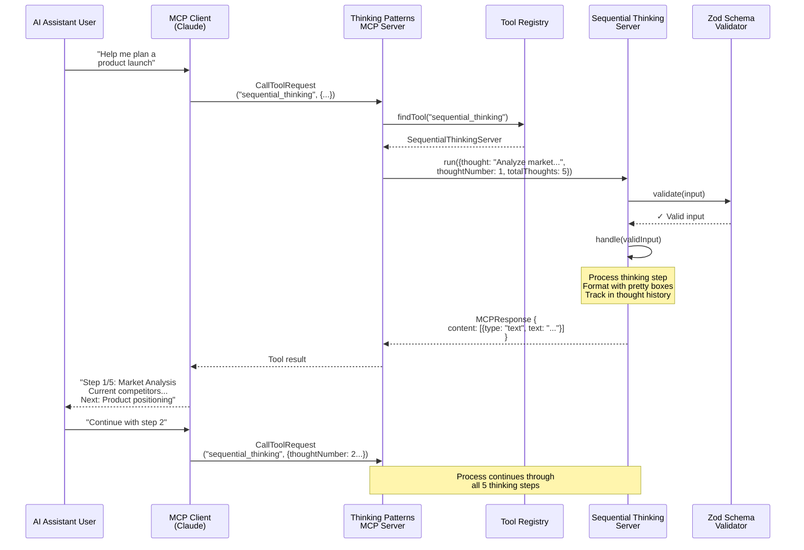

# Technical Architecture Documentation

## Overview

The Thinking Patterns MCP Server is built using TypeScript and follows a modular, schema-driven architecture. The system implements the Model Context Protocol (MCP) to expose cognitive tools to AI assistants.

## Core Technologies

- **TypeScript**: Type-safe implementation with strict typing
- **Node.js**: Runtime environment (v20+)
- **Zod**: Schema validation and type inference
- **MCP SDK**: Model Context Protocol implementation
- **Chalk/Boxen**: Pretty console output formatting

## Architectural Patterns

### 1. **Schema-Driven Design**

Each thinking tool is defined by a Zod schema that:
- Validates input parameters
- Provides TypeScript type inference
- Auto-generates JSON Schema for MCP tool definitions
- Documents expected inputs with descriptions

```typescript
export const MentalModelSchema = z.object({
  modelName: z.string().min(1).describe("The name of the mental model"),
  problem: z.string().min(1).describe("Problem description"),
  steps: z.array(z.string()).optional(),
  reasoning: z.string().optional(),
  conclusion: z.string().optional()
});
```

### 2. **Base Server Pattern**

All tool servers extend `BaseToolServer<TIn, TOut>`:

```typescript
export abstract class BaseToolServer<TIn, TOut> {
  protected schema: z.ZodSchema<TIn>;

  protected validate(input: unknown): TIn
  protected abstract handle(validInput: TIn): TOut
  public run(rawInput: unknown): MCPResponse
}
```

This provides:
- Standardized validation
- Consistent error handling
- Uniform response formatting
- Type safety throughout

### 3. **Tool Registry Pattern**

A centralized registry manages all available tools:

```typescript
interface ToolRegistryEntry<TIn, TOut> {
  name: string;
  schema: z.ZodSchema<TIn>;
  server: BaseToolServer<TIn, TOut>;
  description?: string;
}
```

Benefits:
- Dynamic tool discovery
- Centralized tool management
- Easy addition of new tools
- Automatic MCP tool definition generation

## Component Architecture

### Entry Point (`index.ts`)
- Creates MCP server instance
- Configures stdio transport
- Sets up request handlers
- Initializes tool registry

### Tool Registry (`src/base/toolRegistry.ts`)
- Registers all 15 thinking tools
- Maps tool names to implementations
- Generates MCP tool definitions
- Routes tool requests

### Base Infrastructure (`src/base/`)
- `BaseToolServer.ts`: Abstract base class for all tools
- `toolRegistry.ts`: Tool registration and management

### Schemas (`src/schemas/`)
- 15 schema files defining tool inputs
- Zod schemas with validation rules
- TypeScript type exports
- Detailed field descriptions

### Servers (`src/servers/`)
- 15 server implementations
- Each extends BaseToolServer
- Implements tool-specific logic
- Formats output for readability

### Utilities (`src/utils/`)
- `prettyBox.ts`: Console output formatting
- Helper functions for display

## Data Flow

### High-Level Flow
```
1. Client sends tool request via MCP
   ↓
2. MCP Server receives request
   ↓
3. Tool Registry finds matching tool
   ↓
4. Tool Server validates input with Zod schema
   ↓
5. Server processes request with handle() method
   ↓
6. Response formatted with pretty boxes
   ↓
7. MCP response sent back to client
```

### Detailed Sequence Example


## Tool Implementation Pattern

Each tool follows this structure:

```typescript
// Schema Definition
export const ToolSchema = z.object({
  // Input parameters with validation
});

// Server Implementation
export class ToolServer extends BaseToolServer<ToolData, any> {
  constructor() {
    super(ToolSchema);
  }

  protected handle(validInput: ToolData): any {
    // Tool-specific processing logic
    return processedResult;
  }
}

// Registration
ToolRegistry.register({
  name: "tool_name",
  schema: ToolSchema,
  server: new ToolServer(),
  description: "Tool description"
});
```

## State Management

Most tools are stateless, but some maintain context:

- **Sequential Thinking**: Tracks thought history and branches
- **Collaborative Reasoning**: Maintains session state
- **Scientific Method**: Tracks experiment iterations

Future improvements should use `SessionManager` for proper isolation.

## Error Handling

The system implements multi-layer error handling:

1. **Schema Validation**: Catches invalid inputs early
2. **Server-Level**: Try-catch in BaseToolServer.run()
3. **MCP-Level**: Returns standardized error responses
4. **Custom Errors**: Defined in `src/errors/CustomErrors.ts`

## Output Formatting

Tools use `boxed` utility for visual output:

```typescript
boxed('💭 Sequential Thinking', {
  'Thought': `${thoughtNumber}/${totalThoughts}`,
  'Content': thoughtContent,
  'Status': 'NEXT THOUGHT NEEDED'
});
```

Produces:
```
┌─────────────────────────────────┐
│     💭 Sequential Thinking            │
├─────────────────────────────────┤
│ Thought: 1/5                          │
│ Content: ...                          │
│ Status: NEXT THOUGHT NEEDED           │
└─────────────────────────────────┘
```

## Security Considerations

- Input validation via Zod schemas
- No direct code execution
- Sandboxed within MCP protocol
- No file system access
- No network requests

## Performance Characteristics

- **Startup**: Fast initialization (~100ms)
- **Tool Execution**: Typically <50ms
- **Memory**: Low footprint per tool
- **Scalability**: Stateless design supports concurrent requests

## Extension Points

### Adding New Tools

1. Create schema in `src/schemas/`
2. Create server in `src/servers/`
3. Register in `src/base/toolRegistry.ts`
4. Add tests in `tests/`

### Customizing Output

- Override `formatResponse()` in server
- Modify `prettyBox` utility
- Add custom formatting logic

### Integration Options

- MCP-compatible clients (Claude, etc.)
- Direct TypeScript/JavaScript integration
- Docker containerization
- NPM package distribution

## Testing Strategy

- Unit tests for each server class
- Schema validation tests with Zod
- Integration tests for MCP protocol compatibility
- End-to-end testing via test utilities
- Continuous integration with automated testing

## Deployment Architecture

```
┌─────────────────┐     ┌──────────────┐
│   AI Client        │───▶│  MCP Server      │
│  (e.g. Claude)     │     │   (stdio)        │
└─────────────────┘     └──────────────┘
                              │
                    ┌─────────┴─────────┐
                    │                   │
              ┌─────▼─────┐      ┌─────▼─────┐
              │  Docker     │      │    NPM       │
              │ Container   │      │  Packag e    │
              └───────────┘      └───────────┘
```

## Future Architecture Considerations

1. **Microservices**: Split tools into separate services
2. **Caching**: Add result caching for expensive operations
3. **Metrics**: Add telemetry and usage analytics
4. **Persistence**: Optional state persistence
5. **Clustering**: Support for distributed deployment
